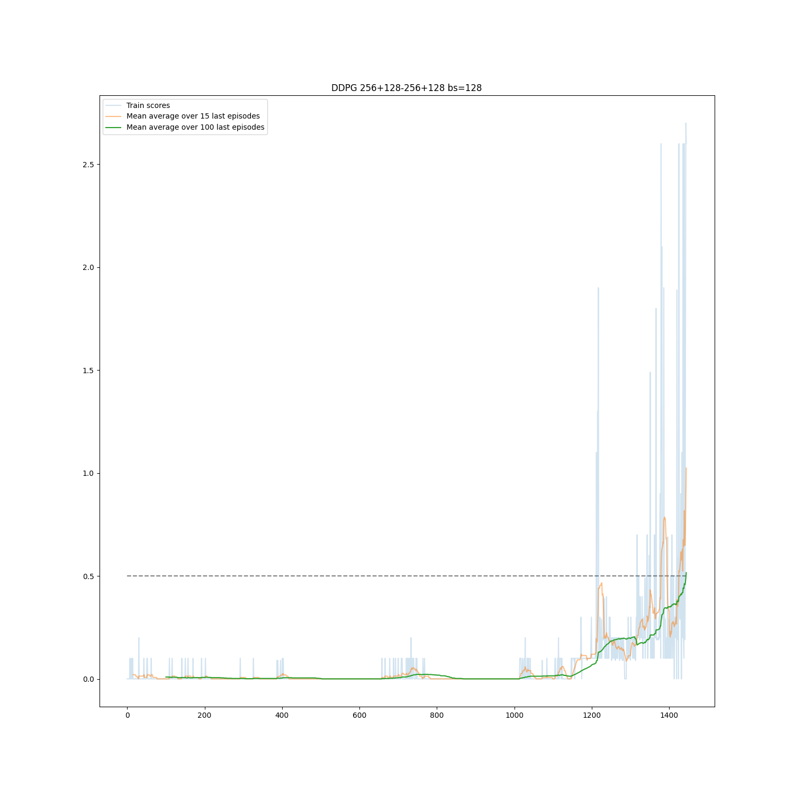

# Implementation details
Implementation assumed one agent to be trained on samples generated by both tennis rockets using DDPG (Deep Deterministic Policy Gradient) algorithm. The algorithm learns proper action using actor critic approach. Critic learns Q-value (estimated future reward) while actor learns proper values depending on state the environment is in.

*Disclaimer*: some of the code was inspided by:
* [Udacity's github Deep Reinforcement repository](https://github.com/udacity/deep-reinforcement-learning/tree/master/ddpg-pendulum)   

and my two previous projects in Nanodegree program:
* [DLR_Navigation](https://github.com/bwosh/DRL_Navigation) project.
* [DRL_ContinuousControl](ttps://github.com/bwosh/DRL_ContinuousControl) project.

## Hiperparameters
As a baseline the code & parameters were taken from my [DRL_ContinuousControl](ttps://github.com/bwosh/DRL_ContinuousControl) with slight modifications: 

* Both actor and critic use **256 & 128** neurons in hidden layers (critic has an addition of action size space in second layer).
* There are two copied of each networks (critic & actor) scause DDPG is an off-policy algorithm. Soft copy with **tau** value o **1e-3** was used
* Reward discount **gamma** was set to 0.99.
* Replay buffer to sample data for training was set to have size of **1e5**. Data was sampled using **batch_size** of **128**.
* The agent was trained after every step of environment.
* Target network was update after every training.

As an addition to previous implementation epsilon-greedy algorithm were used to control amount of noise added to policy actions.
* Initial epsilon value was set to 1.0
* Minimum value was set to 0.01
* Decay factor was set to 0.998 (to reach minimum value in about 3500 episodes)

There were also 300 warmup episodes introduced. Without learning or changing the epsilon value the collection of some raw sample data from the environment first was fired.

## Observations
The code was tested on 1000 eposodes. It seemed that the algorithm is not progressing at all. After some tweaks and similar failures I decided to check what is expected episoede count for this solution. it turned out that 1000 episodes is not enough. 


## Results
I ran the code to reach 10000 episodes with early stopping if it finds the result and got:



To my surprise the environment was solved in just **1445 episodes**. It took 6 minutes and 12 seconds to train (RTX 2080 Max-Q card + i7-9750H processor).

```bash
Environment solved after : 1445 episodes.
Mean score: 0.516 over last 100 episodes.
E1444/10000 M100:0.4909 M10:1.0760 eps:0.101 LOSS:-0.125/0.000:  14%|█████▎                               | 1444/10000 [06:12<36:48,  3.87it/s]
```

# Result model
The model is saved in /data folder and contains:
* [actor_local.pth](/data/actor_local.pth]) - Actor model used for training
* [actor_target.pth](/data/actor_target.pth]) - Target actor model
* [critic_local.pth](/data/critic_local.pth]) - Critic model used for training
* [critic_target.pth](/data/critic_target.pth]) - Target critic model

# Future improvements
There may be further improvements to addres:
* Smaller number of epochs needed to train
* More stable values between epochs

That might involve:
* Hiperparameters tuning:
    * tau in soft copying of networks parameters
    * learning rate
    * batch normalization layers to reduce instability of outliers
    * gamma value to adjust importance of future rewards
* Balancing positive & negative samples in replay memory
* Add custom partial reward for playing ball reaching the center of the field - that's a bit risky cause it would introduce external knowledge to the system but ti might cause training to be faster.